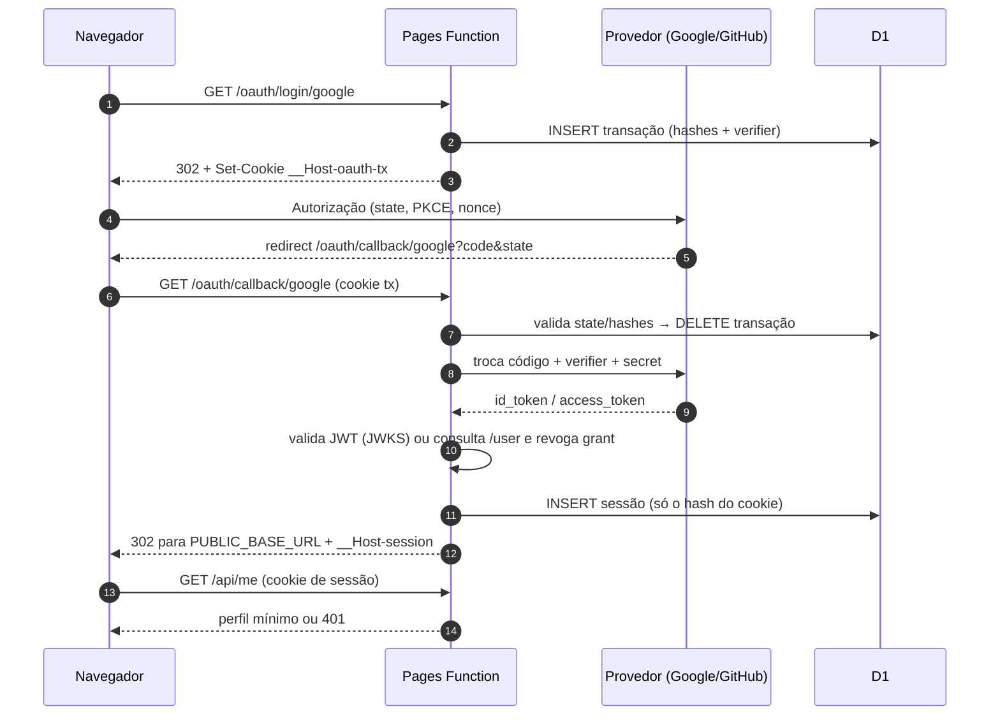

<div align="center">

# 🔐 OAuth Lab

**Autenticação OAuth 2.0 + PKCE com Google e GitHub — hospedada em um único projeto Cloudflare Pages**

[](https://developers.cloudflare.com/pages/)
[](https://developers.cloudflare.com/d1/)
[](https://www.rfc-editor.org/rfc/rfc7636)
[](https://developer.mozilla.org/pt-BR/docs/Web/JavaScript)

</div>

---

## 📖 Sobre

Laboratório de autenticação web: uma página estática pública e rotas dinâmicas de OAuth no **mesmo domínio** (`*.pages.dev`), eliminando CORS e compartilhamento de cookies entre origens.

O navegador **nunca** recebe `access_token`, `refresh_token`, `id_token` ou segredos — apenas um cookie opaco de sessão local, cujo valor o banco de dados nem armazena em claro (guarda o SHA-256).

<div align="center">

| Caminho | Responsabilidade |
|---|---|
| `/` (HTML, CSS, JS) | Conteúdo estático **público** |
| `/oauth/*` (Functions) | Login, callbacks e logout |
| `/api/*` (Functions) | Recursos que exigem sessão local |

</div>

---

## ✨ Destaques de segurança

- **PKCE S256** — `code_verifier` de 32 bytes aleatórios; o servidor nunca o envia na URL
- **CSRF** — `state` aleatório com resumo persistido no D1
- **Replay (OIDC)** — `nonce` no fluxo do Google, validado no `id_token`
- **Validação real do `id_token`** — assinatura RS256 verificada via JWKS do Google (`crypto.subtle`), além de `iss`, `aud`, `exp`, `iat` e `nonce`
- **GitHub sem tokens residuais** — o `access_token` serve só para ler `/user` e é **revogado** (`DELETE /applications/{client_id}/grant`, exigindo 204) antes de a sessão existir
- **Cookies blindados** — `__Host-` prefix (sem `Domain`), `HttpOnly`, `Secure`, `SameSite=Lax` (transação) / `Strict` (sessão, 8 h)
- **Only hashes no banco** — D1 guarda `id_hash`/`state_hash`; vazamento do banco não entrega cookies reutilizáveis
- **Logout defensivo** — só `POST`, `Origin` conferido contra `PUBLIC_BASE_URL`, sessão removida e cookie expirado

---

## 🗂️ Estrutura

```
oauth-pages-lab/
├── public/                  # estático público (build output)
│   ├── index.html
│   ├── app.js
│   ├── styles.css
│   └── entrega1/            # evidências da entrega
└── functions/               # Pages Functions (mesma origem)
    ├── _shared/
    │   ├── crypto.js        # Web Crypto: aleatórios, SHA-256, Base64URL, PKCE
    │   ├── cookies.js       # parse + construção dos cookies __Host-
    │   ├── providers.js     # endpoints e credenciais por provedor
    │   └── oidc.js          # JWKS, JWT e validação de claims
    ├── api/
    │   ├── health.js        # GET /api/health → 200
    │   └── me.js            # GET /api/me → perfil mínimo ou 401
    └── oauth/
        ├── login/[provider].js      # cria transação e redireciona (302)
        ├── callback/[provider].js   # valida retorno e cria sessão
        └── logout.js                # POST: revoga sessão local
```

---

## 🔁 Fluxo



---

## 🚀 Como executar

### ☁️ Produção (o jeito do laboratório)

Tudo pelo painel — sem Node, npm ou Wrangler:

1. **Repositório** — `public/` e `functions/` irmãos na raiz, branch `main`
2. **Pages** — *Workers & Pages → Connect to Git*: framework `None`, build vazio, output `public`
3. **D1** — criar `oauth-sessions-EQUIPE`, rodar o esquema (abaixo) e ligar como variável **`DB`**
4. **Variáveis e segredos** — `PUBLIC_BASE_URL`, `GOOGLE_CLIENT_ID`, `GITHUB_CLIENT_ID` (texto) + `GOOGLE_CLIENT_SECRET`, `GITHUB_CLIENT_SECRET` (criptografados)
5. **Provedores** — cadastrar as URLs de retorno exatas:
   - Google: `URL_BASE/oauth/callback/google`
   - GitHub: `URL_BASE/oauth/callback/github` (Homepage = `URL_BASE`)

```sql
CREATE TABLE oauth_transactions (
    id_hash TEXT PRIMARY KEY,
    provider TEXT NOT NULL CHECK (provider IN ('google', 'github')),
    state_hash TEXT NOT NULL,
    nonce TEXT,
    code_verifier TEXT NOT NULL,
    expires_at INTEGER NOT NULL
);
CREATE INDEX oauth_transactions_expiry ON oauth_transactions (expires_at);

CREATE TABLE sessions (
    id_hash TEXT PRIMARY KEY,
    issuer TEXT NOT NULL,
    subject TEXT NOT NULL,
    email TEXT,
    display_name TEXT,
    expires_at INTEGER NOT NULL,
    created_at INTEGER NOT NULL
);
CREATE INDEX sessions_expiry ON sessions (expires_at);
```

### 💻 Desenvolvimento local (opcional)

```bash
npx wrangler pages dev public --d1 DB=SEU_ID_DE_BANCO
```

> O laboratório oficial é todo via painel; o comando acima é só conveniência para quem quiser iterar localmente.

---

## 🧪 Testes de falha

Os seis casos obrigatórios foram executados e **passaram** — detalhes em [`public/entrega1/07-testes-falha.md`](public/entrega1/07-testes-falha.md):

| # | Caso | Resultado |
|---|---|---|
| 1 | Callback sem `__Host-oauth-tx` | ✅ 400, sem sessão |
| 2 | `state` alterado na URL do provedor | ✅ 400 antes da troca do código |
| 3 | Reutilização da URL de callback | ✅ 400 (transação apagada no 1º uso) |
| 4 | `UPDATE sessions SET expires_at = 0` | ✅ `/api/me` → 401 |
| 5 | `POST /oauth/logout` de outra origem | ✅ 403, sessão intacta |
| 6 | Cookie de sessão restaurado pós-logout | ✅ `/api/me` → 401 |

---

## 📁 Evidências

Disponíveis em [`public/entrega1/`](public/entrega1/) — valores sensíveis substituídos por `[REMOVIDO]`:

| Arquivo | Conteúdo |
|---|---|
| `01-pages-configuracao.pdf` | Projeto, branch e opções de build |
| `02-google-retorno.txt` | URL de retorno do Google |
| `03-github-retorno.txt` | Homepage + callback do GitHub |
| `04-d1-esquema.txt` | Tabelas e índices do `sqlite_schema` |
| `05/06-inicio-login-*.pdf` | Headers saneados do início do login |
| `07-testes-falha.md` | Os 6 casos de falha |
| `08-aceitacao.md` | Checklist final assinado |

---

## 📚 Referências

- [Cloudflare Pages Functions](https://developers.cloudflare.com/pages/functions/) · [Bindings](https://developers.cloudflare.com/pages/functions/bindings/) · [D1](https://developers.cloudflare.com/d1/get-started/)
- [Google — OpenID Connect](https://developers.google.com/identity/openid-connect/openid-connect)
- [GitHub — OAuth apps](https://docs.github.com/en/apps/oauth-apps) · [REST API](https://docs.github.com/en/rest)
- [RFC 7636 — PKCE](https://www.rfc-editor.org/rfc/rfc7636) · [RFC 9700 — OAuth Security BCP](https://www.rfc-editor.org/rfc/rfc9700) · [RFC 10017 — OAuth for Browser-Based Apps](https://www.rfc-editor.org/rfc/rfc10017)
- [OpenID Connect Core 1.0](https://openid.net/specs/openid-connect-core-1_0.html)
